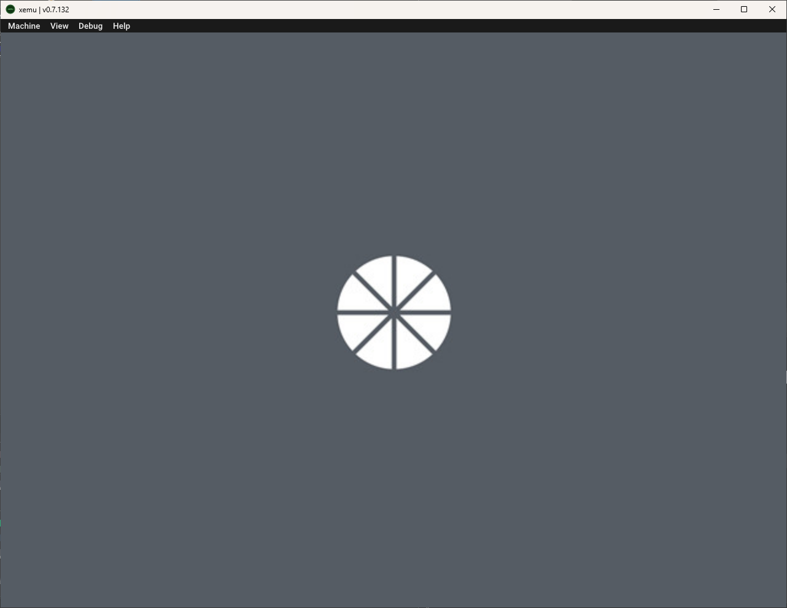

# Moonlight-XboxOG

[](https://github.com/LizardByte/Moonlight-XboxOG)
[](https://github.com/LizardByte/Moonlight-XboxOG/releases/latest)
[](https://github.com/LizardByte/Moonlight-XboxOG/actions/workflows/CI.yml?query=branch%3Amaster)

Port of Moonlight for the Original Xbox. Unlikely to ever actually work. Do NOT use!

Nothing works, except the splash screen.




## Build

### Pre Build

1. Install nxdk prerequisites. Then run the following from mingw64 or bash shell:

```bash
export NXDK_DIR="$(pwd)/third-party/nxdk"
eval "$(${NXDK_DIR}/bin/activate -s)"
cd "${NXDK_DIR}"
make NXDK_ONLY=y
make tools
```

### Configure

1. Create build directory

   ```bash
   mkdir -p build
   ```

2. Configure the project

   ```bash
   cmake -B build -S . -DCMAKE_TOOLCHAIN_FILE="${NXDK_DIR}/share/toolchain-nxdk.cmake"
   ```

### Build

```bash
cmake --build build
```

### Combined script

This script takes care of everything, except installing the prerequisites.

```bash
./build.sh
```

## Todo:

- Build
   - [x] Build in GitHub CI
   - [x] Build with CMake instead of Make, see https://github.com/Ryzee119/Xenium-Tools/blob/master/CMakeLists.txt and https://github.com/abaire/nxdk_pgraph_tests/blob/4b7934e6d612a6d17f9ec229a2d72601a5caefc4/CMakeLists.txt
   - [ ] Get build environment working with CLion directly instead of using external terminal
      - [ ] debugger, see https://github.com/abaire/xbdm_gdb_bridge
   - [ ] Add a run config for CLion, see https://github.com/Subtixx/XSampleProject
   - [ ] Automatically run built xiso in Xemu
   - [x] Add unit testing framework
      - [x] Separate main build and unit test builds, due to cross compiling, see https://stackoverflow.com/a/64335131/11214013
      - [ ] Get tests to properly compile
      - [ ] Enable codecov
   - [x] Enable sonarcloud
   - [x] Build moonlight-common-c
      - [x] Build custom enet, depends on https://github.com/XboxDev/nxdk/pull/680 or https://github.com/thrimbor/nxdk/tree/winsock/lib/winapi (seems unlikely nxdk will ever be ready for this, could definitely use some help with this)
- Menus / Screens
   - [x] Loading/splash screen
      - [x] Initial loading screen, see https://github.com/XboxDev/nxdk/blob/master/samples/sdl_image/main.c
      - [x] Set video mode based on best available mode
      - [x] dynamic splash screen (size based on current resolution)
      - [ ] two images (background color, and logo) to reduce total size... stretch background color image... or don't even use an image for the background
   - [ ] Main/Home
   - [ ] Settings
   - [ ] Add Host
   - [ ] Game/App Selection
   - [ ] Host Details
   - [ ] App Details
   - [ ] Pause/Hotkey overlay
- Streaming
   - [ ] Video - https://www.xbmc4xbox.org.uk/wiki/XBMC_Features_and_Supported_Formats#Xbox_supported_video_formats_and_resolutions
   - [ ] Audio
      - [ ] Mono
      - [ ] Stereo
      - [ ] 5.1 Surround
      - [ ] 7.1 Surround
- Input
   - [ ] Gamepad Input
   - [ ] Keyboard Input
   - [ ] Mouse Input
   - [ ] Mouse Emulation via Gamepad
- Misc.
  - [ ] Save config and pairing states, probably use nlohmann/json
  - [ ] Host pairing
  - [ ] Possibly, GPU overclocking, see https://github.com/GXTX/XboxOverclock
  - [ ] Docs via doxygen
